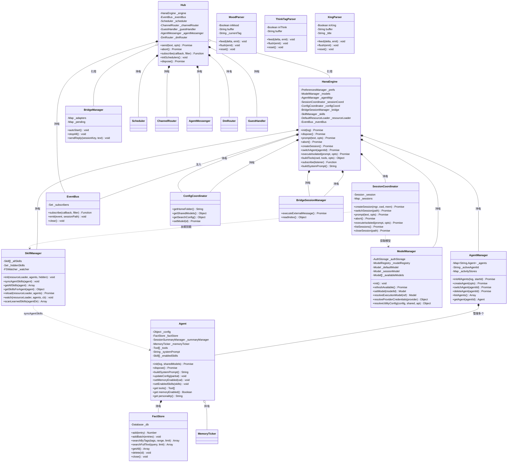
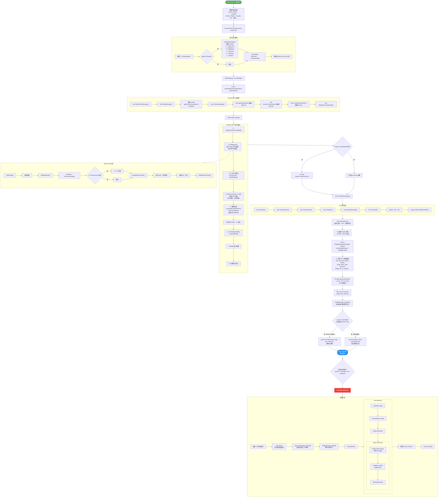

# 深度架构分析与 Mermaid 可视化

本文档从技术实现层面深度讲解 OpenHanako 的目录结构设计逻辑、整体架构核心设计思路、各功能模块的具体职责、模块间协同工作流程与数据流转方式，并提供三套完整的 Mermaid 可视化图。

---

## 第一部分：目录结构设计逻辑

### 1.1 分层原则

OpenHanako 的目录结构遵循**严格的分层架构**，每一层只依赖其下层，不允许反向依赖：

```
desktop/  ← 表现层（Electron + React）
   ↓ HTTP/WS
server/   ← 接口层（Fastify REST + WebSocket）
   ↓ 方法调用
hub/      ← 调度层（消息路由 + 事件总线 + 定时调度）
   ↓ 方法调用
core/     ← 引擎层（Agent + Session + Model + Skill + Config 管理）
   ↓ 方法调用
lib/      ← 基础设施层（记忆 + 沙盒 + 工具 + Bridge + LLM + 模板）
```

这种分层的设计动机是：

1. **desktop 与 server 进程隔离** — desktop 是 Electron 主进程（CJS），server 是 fork 出的子进程（ESM）。两者通过 IPC + HTTP/WS 通信，server 崩溃不会导致窗口消失。

2. **server 可独立运行** — `npm run server` 可以不依赖 Electron 启动，附带 CLI 终端交互。这意味着 server 以下的所有层（hub、core、lib）不能有任何 Electron 依赖。

3. **hub 从 core 分离** — core 是纯引擎逻辑（Agent 怎么工作），hub 是调度逻辑（消息怎么路由、什么时候触发心跳）。分离后，core 可以被 hub 以外的调用者直接使用（如测试）。

4. **lib 是无状态工具箱** — lib 下的每个子目录是一个独立的功能域（memory、sandbox、tools、bridge），它们之间尽量不互相依赖，由 core 层组装。

### 1.2 core/ 的扁平设计

core/ 有 14 个 JS 文件，全部平铺在一级目录下，没有子目录。这是刻意的设计：

- **所有 Manager 平级** — AgentManager、SessionCoordinator、ModelManager、SkillManager 等都是 HanaEngine 的直接成员，没有层级嵌套。
- **依赖注入而非 import** — Manager 之间通过构造器注入的 getter 函数互相访问，而非直接 import。这避免了循环依赖，也使得每个 Manager 可以独立测试。

```javascript
// engine.js 中的依赖注入模式
this._agentMgr = new AgentManager({
  getPrefs: () => this._prefs,        // 延迟求值
  getModels: () => this._models,       // 避免初始化顺序问题
  getHub: () => this._hub,            // Hub 在 Engine 之后创建
  getEngine: () => this,              // 反向引用
});
```

### 1.3 lib/ 的领域划分

lib/ 按功能域划分子目录，每个子目录是一个内聚的功能单元：

| 子目录 | 领域 | 对外接口 | 状态 |
|--------|------|----------|------|
| `memory/` | 记忆存储与检索 | FactStore, SessionSummaryManager, createMemoryTicker, compile | 有状态（SQLite DB） |
| `sandbox/` | 安全沙盒 | createSandboxedTools | 无状态（每次调用创建） |
| `tools/` | Agent 工具定义 | createXxxTool 工厂函数 | 无状态 |
| `bridge/` | 外部平台适配 | BridgeManager, adapters | 有状态（连接） |
| `desk/` | 书桌系统 | DeskManager, CronStore, ActivityStore | 有状态（文件） |
| `llm/` | LLM 调用 | callProviderText | 无状态 |
| `browser/` | 浏览器控制 | BrowserManager（单例） | 有状态 |
| `yuan/` | 人格模板 | .md 文件 | 无状态（纯文本） |
| `ishiki-templates/` | 意识模板 | .md 文件 | 无状态 |
| `identity-templates/` | 身份模板 | .md 文件 | 无状态 |

### 1.4 hub/ 的路由表设计

hub/ 的核心设计是一个**显式路由表**。所有消息都通过 `hub.send()` 进入，按优先级匹配路由规则：

```javascript
// hub/index.js — 路由表
const routes = [
  { match: o => o.from && o.to,                                    handle: AgentMessenger },
  { match: o => !o.sessionKey && !o.ephemeral && o.role === "owner", handle: engine.prompt },
  { match: o => o.sessionKey && o.role === "guest",                 handle: GuestHandler },
  { match: o => o.sessionKey && !o.ephemeral,                       handle: engine.executeExternalMessage },
  { match: o => o.ephemeral,                                        handle: engine.executeIsolated },
];
```

这种设计的优势：
- **所有路由逻辑集中在一处**，不散落在各处的 if-else 中
- **优先级通过位置保证**，新增路由只需在正确位置插入
- **每条路由的 match 条件是纯函数**，易于理解和测试

---

## 第二部分：模块职责与协同

### 2.1 各模块职责矩阵

| 模块 | 核心类 | 职责 | 持有状态 | 依赖 |
|------|--------|------|----------|------|
| `desktop/main.cjs` | — | 窗口管理、Server fork、嵌入浏览器、IPC | 窗口引用、进程引用 | Electron |
| `desktop/src/react/` | App, stores | UI 渲染、用户交互、状态管理 | Zustand store | React, Zustand |
| `server/index.js` | — | HTTP/WS 服务、路由注册、生命周期 | Fastify 实例 | Fastify, core, hub, lib |
| `server/routes/chat.js` | — | WebSocket 聊天、流式解析、事件广播 | 解析器状态、客户端集合 | events.js, hub |
| `hub/index.js` | Hub | 消息路由、调度器管理 | EventBus, Scheduler | core |
| `hub/event-bus.js` | EventBus | 发布/订阅事件 | 订阅者集合 | 无 |
| `hub/scheduler.js` | Scheduler | 心跳 + Cron 调度 | 定时器 | desk/, core |
| `hub/channel-router.js` | ChannelRouter | 频道消息轮询与回复 | 轮询状态 | channels/, core |
| `hub/agent-messenger.js` | AgentMessenger | Agent 间私聊 | 冷却期状态 | agent-executor |
| `hub/dm-router.js` | DmRouter | 私信路由 | 重入锁 | agent-executor |
| `core/engine.js` | HanaEngine | Thin Facade，统一 API | 所有 Manager | 所有 core 模块 |
| `core/agent.js` | Agent | 单个 AI 助手实例 | config, tools, memory, prompt | lib/memory, lib/tools |
| `core/agent-manager.js` | AgentManager | 多 Agent 生命周期 | agents Map | Agent |
| `core/session-coordinator.js` | SessionCoordinator | Session 生命周期 | sessions Map | Pi SDK |
| `core/model-manager.js` | ModelManager | 模型发现与切换 | 模型列表 | Pi SDK |
| `core/skill-manager.js` | SkillManager | 技能加载与同步 | 技能列表 | ResourceLoader |
| `core/events.js` | MoodParser, ThinkTagParser, XingParser | 流式标签解析 | buffer | 无 |
| `lib/memory/fact-store.js` | FactStore | 元事实 CRUD + FTS5 搜索 | SQLite DB | better-sqlite3 |
| `lib/memory/memory-ticker.js` | — | 记忆定时编译调度 | 定时器、计数器 | compile, deep-memory |
| `lib/memory/compile.js` | — | 四阶段记忆编译 | 指纹缓存文件 | LLM |
| `lib/sandbox/index.js` | — | 沙盒工具工厂 | 无 | policy, path-guard, seatbelt/bwrap |
| `lib/bridge/bridge-manager.js` | BridgeManager | 外部平台统一管理 | adapter 实例 | adapters, hub |
| `lib/browser/browser-manager.js` | BrowserManager | 嵌入浏览器控制 | 浏览器状态 | Electron IPC |

### 2.2 模块间协同：数据流转方式

系统中存在三种主要的数据流转方式：

#### 方式一：同步方法调用（同进程）

```
hub.send() → engine.prompt() → session.prompt() → Pi SDK → AI 模型
```

hub、core、lib 运行在同一个 Node.js 进程中，通过直接方法调用通信。这是最高效的方式，也是系统内部的主要通信机制。

#### 方式二：事件发布/订阅（同进程，异步解耦）

```
Session 产生事件 → session.subscribe() → engine._emitEvent()
  → EventBus.emit() → 所有订阅者（chat.js、BridgeManager 等）
```

EventBus 实现了观察者模式，将事件的生产者和消费者解耦。chat.js 订阅 EventBus 后，将事件转换为 WebSocket 消息广播给前端。

#### 方式三：IPC / HTTP / WebSocket（跨进程）

```
desktop (主进程) ←→ server (子进程)：IPC（fork 通道）
desktop (渲染进程) ←→ server：HTTP REST + WebSocket
外部平台 ←→ BridgeManager：平台 SDK（WebSocket/长轮询）
```

跨进程通信使用标准协议，确保各进程可以独立运行和调试。

### 2.3 关键协同流程

#### 流程一：用户发送消息的完整链路

```
用户输入 "你好"
  │
  ├─ InputArea.handleSend()
  │    └─ ws.send({ type: "prompt", text: "你好" })
  │
  ├─ chat.js ws.on("message")
  │    ├─ beginSessionStream(ss)
  │    ├─ broadcast({ type: "status", isStreaming: true })
  │    └─ hub.send("你好")
  │
  ├─ Hub.send() 路由匹配
  │    └─ match: !sessionKey && !ephemeral && role === "owner"
  │    └─ engine.prompt("你好")
  │
  ├─ SessionCoordinator.prompt()
  │    ├─ session.prompt("你好")  ← Pi SDK
  │    └─ agent._memoryTicker.notifyTurn(sessionPath)
  │
  ├─ Pi SDK 内部
  │    ├─ 读取 agent.systemPrompt（包含人格+记忆+技能）
  │    ├─ 构建 messages 数组
  │    ├─ 调用 AI 模型 API（流式）
  │    └─ 逐 token 产生 events
  │
  ├─ session.subscribe() 捕获事件
  │    └─ engine._emitEvent(event, sessionPath)
  │    └─ EventBus.emit(event, sessionPath)
  │
  ├─ chat.js 的 hub.subscribe() 回调
  │    ├─ event.type === "message_update" && sub === "text_delta"
  │    │    └─ ThinkTagParser.feed(delta)
  │    │         └─ MoodParser.feed(text)
  │    │              └─ XingParser.feed(text)
  │    │                   └─ broadcast({ type: "text_delta", delta })
  │    │
  │    ├─ event.type === "tool_execution_start"
  │    │    └─ broadcast({ type: "tool_start", name, args })
  │    │
  │    └─ event.type === "turn_end"
  │         ├─ flush 所有 parser
  │         ├─ broadcast({ type: "turn_end" })
  │         ├─ finishSessionStream(ss)
  │         └─ maybeGenerateFirstTurnTitle()
  │
  └─ 前端 WebSocket.onmessage
       ├─ text_delta → 追加到聊天气泡
       ├─ mood_start/text/end → 折叠的内心活动
       ├─ tool_start/end → 工具调用卡片
       └─ turn_end → 结束 streaming 状态
```

#### 流程二：记忆从产生到被使用

```
对话进行中（每 6 轮触发）
  │
  ├─ memoryTicker.notifyTurn(sessionPath)
  │    └─ turnCount % 6 === 0 → 触发
  │
  ├─ rollingSummary(sessionId, messages)
  │    ├─ 读取对话消息
  │    ├─ 转换为文本格式
  │    ├─ 调用 LLM 生成/更新摘要
  │    └─ 保存到 summaries/{sessionId}.json
  │
  ├─ compileToday()
  │    ├─ 读取当天所有 session 摘要
  │    ├─ 计算指纹，与缓存比较
  │    ├─ 指纹变化 → 调用 LLM 编译 → 写入 today.md
  │    └─ 指纹未变 → 跳过
  │
  ├─ assemble()
  │    ├─ 读取 facts.md + today.md + week.md + longterm.md
  │    └─ 拼接为 memory.md
  │
  ├─ agent.buildSystemPrompt()
  │    ├─ 读取 memory.md
  │    └─ 注入到 System Prompt 的"记忆"段
  │
  └─ 下次对话时，AI 模型看到更新后的记忆
```

```
Session 结束时（额外步骤）
  │
  ├─ 上述流程 +
  │
  ├─ deep-memory: processDirtySessions()
  │    ├─ 找到 summary !== snapshot 的 session
  │    ├─ 调用 LLM 提取元事实
  │    │    输出: [{ fact, tags, time }]
  │    ├─ factStore.addBatch() → 写入 facts.db
  │    └─ markProcessed() → 更新 snapshot
  │
  └─ 元事实可通过 search_memory 工具被 Agent 主动搜索
```

#### 流程三：外部平台消息的完整链路

```
Telegram 用户发送消息
  │
  ├─ telegram-adapter.onMessage(msg)
  │    └─ BridgeManager._onAdapterMessage(msg)
  │
  ├─ BridgeManager
  │    ├─ 判断是否为 /stop 或 /abort → abort session
  │    ├─ 入 _pending 缓冲
  │    └─ debounce 2s 后 _flushPending()
  │
  ├─ _flushPending()
  │    ├─ 正在 streaming? → steerBridgeSession()（插话）
  │    └─ 否 → hub.send(text, { sessionKey: "tg-dm-xxx", role })
  │
  ├─ Hub.send() 路由匹配
  │    ├─ role === "guest" → GuestHandler
  │    │    └─ 加前缀 [来自 xxx] → executeExternalMessage()
  │    └─ role === "owner" → engine.executeExternalMessage()
  │
  ├─ BridgeSessionManager.executeExternalMessage()
  │    ├─ 创建/复用 Bridge Session
  │    ├─ 调用 AI 模型
  │    └─ 流式输出
  │
  ├─ BridgeManager 订阅流式事件
  │    ├─ StreamCleaner: 去除 <mood>, <pulse>, <reflect> 等标签
  │    ├─ BlockChunker: 按结构分块
  │    └─ adapter.sendBlockReply(): 分段发送
  │
  └─ Telegram 用户收到多条消息（气泡效果）
```

---

## 第三部分：Mermaid 可视化

### 图一：模块协同架构图

```mermaid
graph TB
    subgraph "表现层 desktop/"
        MAIN_CJS["main.cjs<br/>Electron 主进程"]
        PRELOAD["preload.cjs<br/>contextBridge"]
        REACT["React 前端<br/>App.tsx + Zustand"]
        SETTINGS["Settings 窗口<br/>SettingsApp.tsx"]
        BROWSER_VIEW["WebContentsView<br/>嵌入式浏览器"]
    end

    subgraph "接口层 server/"
        SERVER["index.js<br/>Fastify HTTP + WS"]
        CHAT_ROUTE["routes/chat.js<br/>WebSocket 聊天"]
        BRIDGE_ROUTE["routes/bridge.js<br/>外部平台 API"]
        REST_ROUTES["routes/*<br/>REST API"]
        CLI["cli.js<br/>终端交互"]
    end

    subgraph "调度层 hub/"
        HUB["Hub<br/>消息路由"]
        EVENT_BUS["EventBus<br/>发布/订阅"]
        SCHEDULER["Scheduler<br/>心跳 + Cron"]
        CHANNEL_ROUTER["ChannelRouter<br/>频道调度"]
        AGENT_MSG["AgentMessenger<br/>Agent 间私聊"]
        DM_ROUTER["DmRouter<br/>私信路由"]
        GUEST["GuestHandler<br/>访客处理"]
    end

    subgraph "引擎层 core/"
        ENGINE["HanaEngine<br/>Thin Facade"]
        AGENT["Agent<br/>AI 助手实例"]
        AGENT_MGR["AgentManager<br/>多 Agent 管理"]
        SESSION_COORD["SessionCoordinator<br/>Session 生命周期"]
        MODEL_MGR["ModelManager<br/>模型发现/切换"]
        SKILL_MGR["SkillManager<br/>技能加载/同步"]
        CONFIG_COORD["ConfigCoordinator<br/>配置管理"]
        BRIDGE_SESSION["BridgeSessionManager<br/>外部平台 Session"]
        EVENTS["MoodParser / ThinkTagParser<br/>/ XingParser 流式解析"]
    end

    subgraph "基础设施层 lib/"
        FACT_STORE["FactStore<br/>SQLite FTS5"]
        MEM_TICKER["MemoryTicker<br/>记忆调度"]
        COMPILE["compile.js<br/>四阶段编译"]
        DEEP_MEM["deep-memory.js<br/>元事实提取"]
        SANDBOX["sandbox/<br/>PathGuard + OS 沙盒"]
        TOOLS["tools/<br/>15+ Agent 工具"]
        BRIDGE_MGR["BridgeManager<br/>平台统一管理"]
        TG_ADAPTER["telegram-adapter"]
        FS_ADAPTER["feishu-adapter"]
        QQ_ADAPTER["qq-adapter"]
        BROWSER_MGR["BrowserManager<br/>浏览器控制"]
        LLM["provider-client.js<br/>LLM 调用"]
        YUAN["yuan/ ishiki/<br/>人格模板"]
        DESK["desk/<br/>CronStore + ActivityStore"]
    end

    subgraph "外部"
        AI_MODEL["AI 模型 API<br/>Claude / GPT / DeepSeek"]
        TELEGRAM["Telegram"]
        FEISHU["飞书"]
        QQ["QQ"]
        PI_SDK["Pi SDK<br/>@mariozechner/pi-coding-agent"]
    end

    %% 表现层 → 接口层
    MAIN_CJS -->|"fork()"| SERVER
    MAIN_CJS -->|"IPC: ready/shutdown"| SERVER
    REACT -->|"HTTP/WS"| SERVER
    SETTINGS -->|"HTTP"| REST_ROUTES
    MAIN_CJS -.->|"IPC: browser-cmd"| BROWSER_VIEW

    %% 接口层内部
    SERVER --> CHAT_ROUTE
    SERVER --> BRIDGE_ROUTE
    SERVER --> REST_ROUTES
    SERVER -->|"独立运行"| CLI

    %% 接口层 → 调度层
    CHAT_ROUTE -->|"hub.send()"| HUB
    CHAT_ROUTE -->|"hub.subscribe()"| EVENT_BUS
    BRIDGE_ROUTE --> BRIDGE_MGR

    %% 调度层内部
    HUB --> EVENT_BUS
    HUB --> SCHEDULER
    HUB --> CHANNEL_ROUTER
    HUB --> AGENT_MSG
    HUB --> DM_ROUTER
    HUB --> GUEST

    %% 调度层 → 引擎层
    HUB -->|"engine.prompt()"| ENGINE
    HUB -->|"engine.executeIsolated()"| ENGINE
    HUB -->|"engine.executeExternalMessage()"| ENGINE
    SCHEDULER -->|"engine.executeIsolated()"| ENGINE

    %% 引擎层内部
    ENGINE --> AGENT_MGR
    ENGINE --> SESSION_COORD
    ENGINE --> MODEL_MGR
    ENGINE --> SKILL_MGR
    ENGINE --> CONFIG_COORD
    ENGINE --> BRIDGE_SESSION
    AGENT_MGR --> AGENT
    SESSION_COORD -->|"createAgentSession()"| PI_SDK

    %% 引擎层 → 基础设施层
    AGENT --> FACT_STORE
    AGENT --> MEM_TICKER
    AGENT --> TOOLS
    AGENT --> YUAN
    MEM_TICKER --> COMPILE
    MEM_TICKER --> DEEP_MEM
    COMPILE --> LLM
    DEEP_MEM --> FACT_STORE
    ENGINE -->|"buildTools()"| SANDBOX
    BRIDGE_SESSION --> LLM
    BROWSER_MGR -.->|"IPC"| MAIN_CJS

    %% 基础设施层 → 外部
    BRIDGE_MGR --> TG_ADAPTER
    BRIDGE_MGR --> FS_ADAPTER
    BRIDGE_MGR --> QQ_ADAPTER
    TG_ADAPTER --> TELEGRAM
    FS_ADAPTER --> FEISHU
    QQ_ADAPTER --> QQ
    PI_SDK --> AI_MODEL
    LLM --> AI_MODEL

    %% 流式解析链
    CHAT_ROUTE -->|"text_delta"| EVENTS
    EVENTS -->|"解析后事件"| EVENT_BUS

    %% 样式
    classDef external fill:#f9f,stroke:#333
    class AI_MODEL,TELEGRAM,FEISHU,QQ,PI_SDK external
```



### 图二：核心类调用关系图



### 图三：Server 入口 (server/index.js) 执行顺序拆解图



---

## 第四部分：设计思路总结

### 4.1 核心设计思路

**1. Thin Facade + 依赖注入**

HanaEngine 不包含业务逻辑，只做委托。所有 Manager 通过构造器注入的 getter 函数互相访问。这解决了两个问题：
- 避免 God Object（Engine 不会膨胀到数千行）
- 避免循环依赖（getter 延迟求值，初始化顺序无关）

**2. 显式路由表**

Hub 的消息路由不是散落的 if-else，而是一个有序的路由表。每条路由是 `{ match, handle }` 对，优先级由位置决定。这让消息流向一目了然。

**3. 流式解析器链**

AI 输出是逐 token 的流，其中混杂着 `<think>`、`<mood>`、`<xing>` 等标签。解析器链 `ThinkTagParser → MoodParser → XingParser` 逐层剥离标签，最终输出纯文本。每个解析器独立处理一种标签，通过 buffer + trailing prefix 检测解决跨 delta 的标签拆分问题。

**4. 事件驱动解耦**

EventBus 将事件的生产者（Session）和消费者（chat.js、BridgeManager）解耦。chat.js 不需要知道事件从哪来，BridgeManager 也不需要知道前端怎么渲染。新增消费者只需 `hub.subscribe()`。

**5. 记忆的分层编译**

记忆不是简单地存储和检索，而是经过四阶段编译（today → week → longterm → facts）后注入 System Prompt。这确保了：
- 近期记忆更详细，远期记忆更概括
- 总长度可控（≤ 2000 token）
- 指纹缓存避免重复调用 LLM

**6. 沙盒的纵深防御**

三层防御（Preflight → PathGuard → OS 沙盒），任何单一层被绕过，其他层仍然提供保护。Windows 缺少 OS 沙盒是已知的安全弱点，通过 PathGuard 的严格路径检查部分弥补。

**7. 进程隔离与崩溃恢复**

Server 运行在独立进程中，崩溃时 Electron 主进程可以自动重启。优雅关闭有 15 秒超时保护，确保记忆 tick 完成后再关闭数据库。
