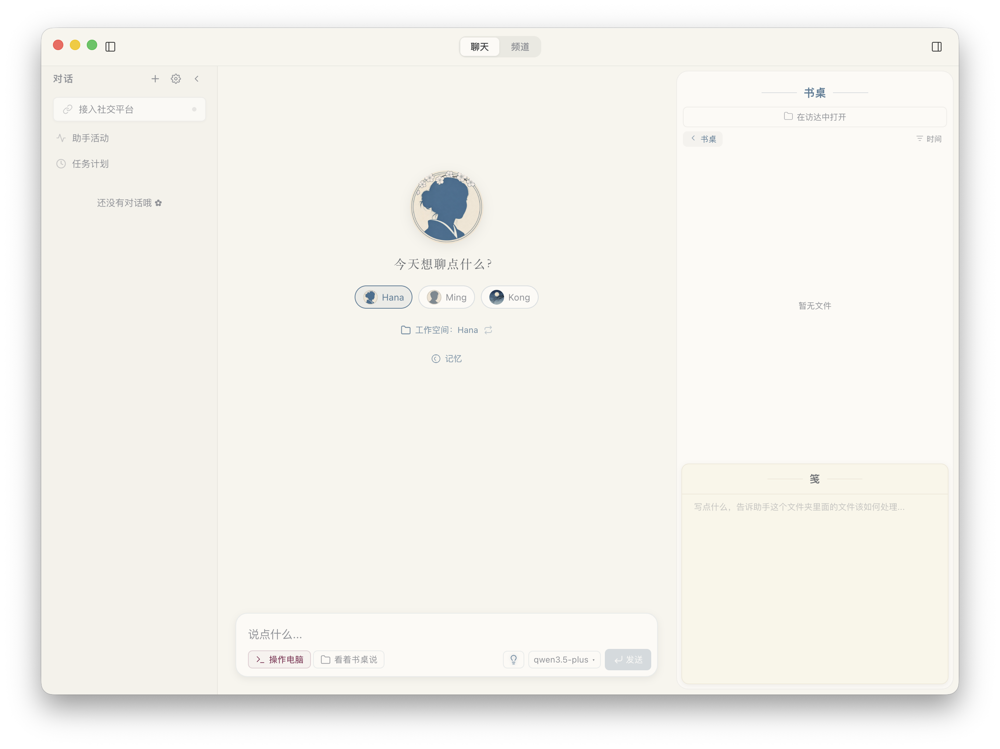

<p align="center">
  
</p>

<p align="center">
  
</p>

<h1 align="center">OpenHanako</h1>

<p align="center">A personal AI agent with memory and soul</p>

<p align="center"><a href="README_CN.md">中文版</a></p>

[](LICENSE)
[](https://github.com/liliMozi/openhanako/releases)

---

## What is Hanako

OpenHanako is a personal AI agent that is easier to use than traditional coding agents. It has memory, personality, and can act autonomously. Multiple agents can work together on your machine.

As an assistant, it is gentle: no complex configuration files, no obscure jargon. Hanako is designed not just for coders, but for everyone who works at a computer.
As a tool, it is powerful: it remembers everything you've said, operates your computer, browses the web, searches for information, reads and writes files, executes code, manages schedules, and can even learn new skills on its own.

## Features

**Memory** — A custom memory system that keeps recent events sharp and lets older ones fade naturally.

**Personality** — Not a generic "AI assistant". Each agent has its own voice and behavior through personality templates. Agents are self-contained folders, easy to back up and manage.

**Tools** — Read/write files, run terminal commands, browse the web, search the internet, take screenshots, draw on a canvas, execute JavaScript. Covers the vast majority of daily work scenarios.

**Skills** — Built-in compatibility with the community Skills ecosystem. Agents can also install skills from GitHub or write their own. Strict safety review enabled by default.

**Multi-Agent** — Create multiple agents, each with independent memory, personality, and scheduled tasks. Agents can collaborate via channel group chats or delegate tasks to each other.

**Desk** — Each agent has a desk for files and notes (Jian). Supports drag-and-drop, file preview, and serves as an async collaboration space between you and your agent.

**Cron & Heartbeat** — Agents can run scheduled tasks and periodically check for file changes on the desk. They work autonomously even when you're away.

**Sandbox** — Two-layer isolation: application-level PathGuard with four access tiers + OS-level sandboxing (macOS Seatbelt / Linux Bubblewrap).

**Multi-Platform Bridge** — A single agent can connect to Telegram, Feishu, QQ bots simultaneously. Chat from any platform and remotely operate your computer.

## Screenshots

<p align="center">
  
</p>

## Quick Start

### Download

**macOS (Apple Silicon):** download the latest `.dmg` from [Releases](https://github.com/liliMozi/openhanako/releases).

> **macOS Gatekeeper notice:** The app is not yet signed with an Apple Developer ID. On first launch, macOS may block it. Right-click the app → select **Open** → click **Open** in the dialog. You only need to do this once.

**Windows:** download the latest `.exe` installer from [Releases](https://github.com/liliMozi/openhanako/releases).

> **Windows SmartScreen notice:** The installer is not yet code-signed. Windows Defender SmartScreen may show a warning on first run. Click **More info** → **Run anyway**. This is expected for unsigned builds.

Linux builds are planned.

### First Run

On first launch, an onboarding wizard will guide you through setup: choose a language, enter your name, connect a model provider (API key + base URL), and select three models — a **chat model** (main conversation), a **utility model** (lightweight tasks like summarization), and a **utility large model** (memory compilation and deep analysis). Hanako uses the OpenAI-compatible protocol, so any provider that supports it will work (OpenAI, DeepSeek, Qwen, local models via Ollama, etc.).

## Architecture

```
core/           Engine orchestration + Managers
lib/            Core libraries (memory, tools, sandbox, bridge adapters)
server/         Fastify HTTP + WebSocket server
hub/            Scheduler, ChannelRouter, EventBus
desktop/        Electron app + React frontend
tests/          Vitest test suite
skills2set/     Built-in skill definitions
```

The engine layer coordinates five managers (Agent, Session, Model, Preferences, Skill) and exposes them through a unified facade. The Hub handles background tasks (heartbeat, cron, channel routing) independently of the active chat session. Communication between the Electron main process and the server runs over a child process stdio bridge.

## Tech Stack

| Layer | Technology |
|-------|-----------|
| Desktop | Electron 38 |
| Frontend | React 19 + Vite 7 (migrating from vanilla JS) |
| Server | Fastify 5 |
| Agent Runtime | [Pi SDK](https://github.com/nicepkg/pi) |
| Database | better-sqlite3 (WAL mode) |
| Testing | Vitest |

## Platform Support

| Platform | Status |
|----------|--------|
| macOS (Apple Silicon) | Supported |
| macOS (Intel) | Untested, should work |
| Windows | Beta |
| Linux | Planned |
| Mobile | Planned |

## License

[Apache License 2.0](LICENSE)

## Links

- [Homepage](https://openhanako.com)
- [Report an Issue](https://github.com/liliMozi/openhanako/issues)
- [Security](https://github.com/liliMozi/openhanako/security)
- [Security Policy](SECURITY.md)
- [Contributing](CONTRIBUTING.md)
