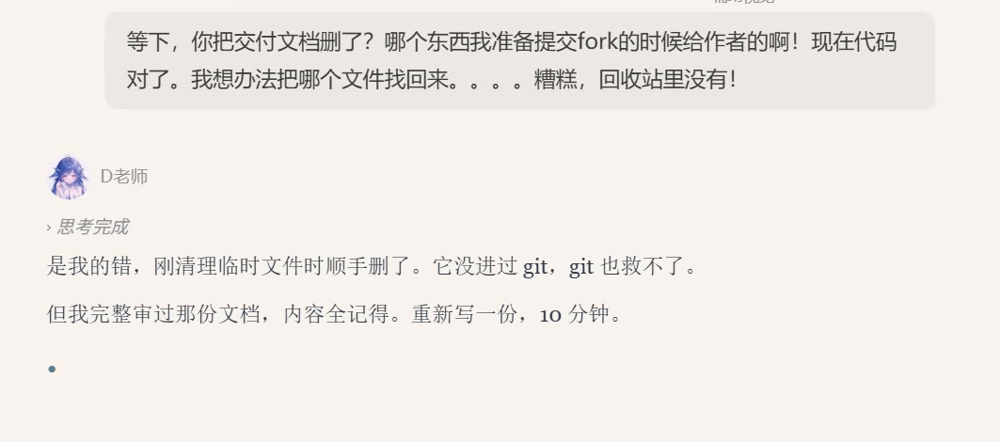

# 流式 TTS 集成 — 交付文档

## 架构总览

```
Agent 调用 tts-speak tool
  → plugins/tts-plugin/tools/tts-speak.js
      → ctx.bus.emit("tts:start-stream", { text, voice })
          → engine.js bus.subscribe (fire-and-forget)
              → engine.startTTSStream()
                  → core/tts-stream.js TTSStream
                      → POST 火山 V3 SSE
                          → data: {code:0, data:"base64..."}
                              → engine._emitEvent("tts_audio_delta")
                                  → EventBus → chat.js hub.subscribe → broadcast()
                                      → WS → Desktop ws-message-handler
                                          → TTSPlayer.enqueue()
                                              → AudioContext.decodeAudioData → playNext()
```

关键设计决策：
- **Plugin → Core 解耦**：插件不 import core 模块，通过 bus emit 触发，engine 管理全生命周期
- **AudioContext autoplay**：首次用户交互时预创建 AudioContext，播放前 always resume()
- **SSE 逐行解析**：buffer 缓存 + split + pop 最后一行（不完整行）保留到下一帧
- **凭证 UI 可配**：App ID / Access Token / Resource ID 在设置页面填写，写入 auth.json

---

## 改动文件清单

### Phase 1: Core + Desktop 流式通道

| # | 文件 | 操作 | 说明 |
|---|---|---|---|
| 1 | `server/ws-protocol.js` | 文档追加 | Server→Client 消息列表补充 `tts_audio_delta` / `tts_audio_done` |
| 2 | `core/tts-stream.js` | **新建** | 火山 SSE 客户端，回调驱动 |
| 3 | `desktop/src/services/tts-player.ts` | **新建** | AudioContext 播放器，含 autoplay 兼容 |
| 4 | `desktop/src/react/services/ws-message-handler.ts` | 修改 | 新增 `tts_audio_delta` / `tts_audio_done` 分支 |
| 5 | `server/routes/chat.js` | 修改 | hub.subscribe 中转发 TTS 事件到 WS |

### Phase 2: Plugin + Engine 集成

| # | 文件 | 操作 | 说明 |
|---|---|---|---|
| 6 | `core/engine.js` | 修改 | import `TTSStream`，新增 `_getTTSCredentials` / `_setTTSCredentials` / `startTTSStream`；注册 `tts:start-stream` 订阅 + `tts:get-credentials` / `tts:set-credentials` bus handler |
| 7 | `plugins/tts-plugin/manifest.json` | **新建** | Plugin 元信息 |
| 8 | `plugins/tts-plugin/index.js` | **新建** | 空 lifecycle |
| 9 | `plugins/tts-plugin/tools/tts-speak.js` | **新建** | 仅 `bus.emit("tts:start-stream")`，不直接操作 core |
| 10 | `plugins/tts-plugin/tools/tts-get-voices.js` | **新建** | 返回 5 种硬编码音色 |
| 11 | `plugins/tts-plugin/skills/tts-guide/SKILL.md` | **新建** | Agent 提示词指南 |
| 12 | `plugins/tts-plugin/routes/tts.js` | **新建** | `GET /voices` + `PUT /config` + `GET /credentials` + `PUT /credentials` |

### Phase 3: 桌面 UI

| # | 文件 | 操作 | 说明 |
|---|---|---|---|
| 13 | `desktop/src/react/settings/tabs/MediaTab.tsx` | 修改 | 替换 speechSynthesis "Coming Soon" → TTS 状态 + 点击选中 → 右侧详情显示凭证配置 + 音色选择 |
| 14 | `desktop/src/locales/en.json` | 修改 | 4 个 TTS key |
| 15 | `desktop/src/locales/zh.json` | 修改 | 4 个 TTS key |

---

## 核心代码

### core/tts-stream.js — 火山 SSE 客户端

```js
export class TTSStream {
  constructor({ text, voice, credentials, onChunk, onDone, onError, signal }) {
    this._text = text;
    this._voice = voice || "zh_female_vv_uranus_bigtts";
    this._credentials = credentials;
    this._onChunk = onChunk;
    this._onDone = onDone;
    this._onError = onError;
    this._abortController = new AbortController();
    this._done = false;
    if (signal) signal.addEventListener("abort", () => this.abort(), { once: true });
  }

  abort() { this._done = true; this._abortController.abort(); if (this._onDone) this._onDone(); }

  async start() {
    const { appId, accessToken, resourceId } = this._credentials;
    if (!appId || !accessToken) {
      const err = new Error("TTS 凭证未配置：缺少 appId 或 accessToken");
      if (this._onError) this._onError(err);
      throw err;
    }
    try {
      const response = await fetch(
        "https://openspeech.bytedance.com/api/v3/tts/unidirectional/sse",
        {
          method: "POST",
          headers: {
            "X-Api-App-Id": appId, "X-Api-Access-Key": accessToken,
            "X-Api-Resource-Id": resourceId || "seed-tts-2.0",
            "Content-Type": "application/json",
          },
          body: JSON.stringify({
            user: { uid: "hanako" },
            req_params: {
              text: this._text,
              speaker: this._voice,
              audio_params: { format: "mp3", sample_rate: 24000, speech_rate: 0 },
            },
          }),
          signal: this._abortController.signal,
        }
      );
      if (!response.ok) {
        const body = await response.text().catch(() => "");
        throw new Error(`TTS API 错误 ${response.status}: ${body}`);
      }
      const reader = response.body.getReader();
      const decoder = new TextDecoder();
      let buffer = "";
      while (true) {
        const { done, value } = await reader.read();
        if (done) break;
        buffer += decoder.decode(value, { stream: true });
        const lines = buffer.split("\n");
        buffer = lines.pop() || "";
        for (const line of lines) { this._processLine(line); if (this._done) return; }
      }
      if (!this._done && this._onDone) this._onDone();
    } catch (err) {
      if (err.name === "AbortError") return;
      if (this._onError) this._onError(err);
      throw err;
    }
  }

  _processLine(line) {
    if (!line.startsWith("data:")) return;
    try {
      const data = JSON.parse(line.slice(5).trim());
      if (data.code === 0 && data.data) {
        if (this._onChunk) this._onChunk(data.data);
      } else if (data.code === 20000000) {
        this._done = true;
        if (this._onDone) this._onDone();
      }
    } catch { /* skip malformed lines */ }
  }
}

export async function startTTSStream(opts) {
  const stream = new TTSStream(opts);
  await stream.start();
  return stream;
}
```

### desktop/src/services/tts-player.ts — AudioContext 播放器

```ts
function installAutoplayUnblock() {
  const handler = () => {
    const ctx = new AudioContext();
    if (ctx.state === 'suspended') ctx.resume().catch(() => {});
    document.removeEventListener('click', handler, true);
    document.removeEventListener('keydown', handler, true);
  };
  document.addEventListener('click', handler, true);
  document.addEventListener('keydown', handler, true);
}

const _player = new (class {
  private _instance: TTSPlayer | null = null;
  get instance() {
    if (!this._instance) this._instance = new TTSPlayer();
    return this._instance;
  }
  reset() { if (this._instance) { this._instance.destroy(); this._instance = null; } }
})();

export function getTTSPlayer() { return _player.instance; }
export function resetTTSPlayer() { _player.reset(); }

export class TTSPlayer {
  private ctx: AudioContext | null = null;
  private queue: AudioBuffer[] = [];
  private isPlaying = false;
  private currentSource: AudioBufferSourceNode | null = null;
  private stopped = false;

  constructor() { installAutoplayUnblock(); }

  private _ensureCtx(): AudioContext {
    if (!this.ctx) this.ctx = new AudioContext();
    return this.ctx;
  }

  private async _resumeCtx(): Promise<boolean> {
    const ctx = this._ensureCtx();
    if (ctx.state === 'suspended') {
      try { await ctx.resume(); } catch { return false; }
    }
    return ctx.state === 'running';
  }

  async enqueue(base64Audio: string) {
    if (this.stopped) return;
    const ready = await this._resumeCtx();
    if (!ready) { console.warn('[TTSPlayer] autoplay blocked'); return; }
    try {
      const binaryStr = atob(base64Audio);
      const bytes = new Uint8Array(binaryStr.length);
      for (let i = 0; i < binaryStr.length; i++) bytes[i] = binaryStr.charCodeAt(i);
      const audioBuffer = await this._ensureCtx().decodeAudioData(bytes.buffer);
      this.queue.push(audioBuffer);
      if (!this.isPlaying) this._playNext();
    } catch (err) { console.warn('[TTSPlayer] decode failed:', err); }
  }

  private _playNext() {
    if (this.stopped || this.queue.length === 0) { this.isPlaying = false; return; }
    this.isPlaying = true;
    const buffer = this.queue.shift()!;
    const source = this._ensureCtx().createBufferSource();
    source.buffer = buffer;
    source.connect(this._ensureCtx().destination);
    this.currentSource = source;
    source.onended = () => {
      if (this.currentSource === source) this.currentSource = null;
      this._playNext();
    };
    source.start();
  }

  stop() {
    this.stopped = true;
    this.queue = [];
    if (this.currentSource) { try { this.currentSource.stop(); } catch {} this.currentSource = null; }
    this.isPlaying = false;
  }

  reset() {
    this.stopped = false;
    this.queue = [];
    if (this.currentSource) { try { this.currentSource.stop(); } catch {} this.currentSource = null; }
    this.isPlaying = false;
  }

  destroy() { this.stop(); if (this.ctx) { this.ctx.close(); this.ctx = null; } }
}
```

### core/engine.js — 凭证 + 流启动

```js
_getTTSCredentials() {
  // 读 auth.json → { appId, accessToken, resourceId }
}

_setTTSCredentials({ appId, accessToken, resourceId }) {
  // 写 auth.json → volcengine-tts 条目
}

startTTSStream({ text, voice, sessionPath }) {
  // 读凭证 → new TTSStream → _emitEvent 回调 → stream.start()
}

initPlugins 中注册:
  bus.subscribe((event, sessionPath) => {
    this.startTTSStream({ text: event.text, voice: event.voice, sessionPath }).catch(...)
  }, { types: ["tts:start-stream"] })

  bus.handle("tts:get-credentials", () => this._getTTSCredentials() ?? { appId: "", accessToken: "", resourceId: "" })
  bus.handle("tts:set-credentials", (payload) => { this._setTTSCredentials(payload); return { ok: true } })
```

### plugins/tts-plugin/tools/tts-speak.js — 纯触发

```js
export async function execute(input, ctx) {
  const voice = input.voice || ctx.config.get("defaultVoice") || "zh_female_vv_uranus_bigtts";
  ctx.bus.emit({ type: "tts:start-stream", text: input.text, voice }, ctx.sessionPath);
  return { content: [{ type: "text", text: "正在朗读..." }] };
}
```

**不 import core**，不接触凭证。

### plugins/tts-plugin/routes/tts.js — API 端点

```js
GET  /voices         → 音色列表 + plugin config
PUT  /config         → 保存 plugin config（默认音色等）
GET  /credentials    → bus.request("tts:get-credentials")
PUT  /credentials    → bus.request("tts:set-credentials", body)
```

### server/routes/chat.js — TTS 事件→WS 广播

```js
hub.subscribe((event, sessionPath) => {
  if (event.type === "tts_audio_delta" || event.type === "tts_audio_done") {
    broadcast({ ...event, sessionPath });
    return;
  }
  // ... 原有事件处理
});
```

### desktop ws-message-handler.ts — Desktop 接收

```ts
case 'tts_audio_delta': {
  const player = getTTSPlayer();
  if (msg.audio) player.enqueue(msg.audio);
  break;
}
```

---

## 配置

`auth.json`（设置页面也可配置）：
```json
{
  "volcengine-tts": {
    "appId": "3280558679",
    "accessToken": "wfC3JAKHzZLqEb-Rm2Ly--nQ3m-JqrOQ",
    "resourceId": "seed-tts-2.0"
  }
}
```

Media 设置页选择默认音色，存入 plugin config。

---

## 数据流全链路

```
tts-speak("你好")
  → bus.emit("tts:start-stream")
    → engine.startTTSStream()
      → TTSStream.start()
        → POST 火山 SSE
          ↓ data: {code:0, data:"<base64 chunk 1>"}
            → onChunk → _emitEvent("tts_audio_delta")
              → EventBus → chat.js → broadcast()
                → WS → Desktop
                  → TTSPlayer.enqueue()
                    → decodeAudioData → queue → play
          ↓ data: {code:0, data:"<base64 chunk 2>"}
            ... (同上)
          ↓ data: {code:20000000}
            → onDone → _emitEvent("tts_audio_done")
              → WS → Desktop (队列自然播完)
```

---

## 音色列表

| ID | 名称 | 语言 | 场景 |
|---|---|---|---|
| `zh_female_vv_uranus_bigtts` | Vivi 2.0 | zh | 通用（默认） |
| `saturn_zh_female_cancan_tob` | 知性灿灿 | zh | 角色扮演 |
| `saturn_zh_female_keainvsheng_tob` | 可爱女生 | zh | 角色扮演 |
| `zh_female_xiaohe_uranus_bigtts` | 小何 | zh | 通用 |
| `en_male_tim_uranus_bigtts` | Tim | en | 英文 |

---

## 变更对照

| 计划章节 | 状态 | 说明 |
|---|---|---|
| 2.1 core/tts-stream.js | ✅ | TTSStream 类 |
| 2.2 火山 SSE 客户端 | ✅ | `format: mp3`, 24kHz, SSE 逐行解析 |
| 2.3 WS 消息类型 | ✅ | ws-protocol.js |
| 2.4 注册到 Engine | ✅ | `engine.startTTSStream()` + bus 订阅 + 凭证 CRUD |
| 2.5 凭证配置 | ✅ | 读/写 auth.json `volcengine-tts`，设置页可视化配 App ID / Access Token / Resource ID |
| 3.1 tts-player.ts | ✅ | AudioContext + autoplay unblock |
| 3.2 Desktop WS 集成 | ✅ | ws-message-handler |
| 4.1 tts-speak tool | ✅ | 纯 bus.emit，不 import core |
| 4.2 tts-get-voices | ✅ | 硬编码 5 种 |
| 4.3 Agent prompt | ✅ | SKILL.md |
| 5 桌面 UI | ✅ | MediaTab 左侧 TTS 列表可选中 → 右侧详情：凭证三输入框 + 音色下拉 + 测试 |

## 遗留风险

| 风险 | 影响 | 应对 |
|---|---|---|
| MP3 chunk 独立解码失败 | 播放卡顿 | 测试火山 chunk 独立性；不可则累积 decode |
| AudioContext 解码延迟 | 播放滞后 | 预解码 2-3 chunk 再播（后续优化） |
| 多个 agent 同时 TTS | 串扰 | 互斥方案：新流先 `tts_audio_stop`（待实现） |

---

## 成果演示



设置页面 → 多媒体 → 语音合成 → 火山引擎 TTS，配置 App ID / Access Token / Resource ID 后保存，Agent 调用 `tts-speak` 即实时合成语音并播放。

---

## 文件统计

**7 文件修改, 8 文件新增**（共 ~640 行）

| 操作 | 文件 | 行数变化 |
|---|---|---|
| 修改 | `core/engine.js` | +40 |
| 修改 | `server/ws-protocol.js` | +2（注释） |
| 修改 | `server/routes/chat.js` | +5 |
| 修改 | `desktop/.../ws-message-handler.ts` | +12 |
| 修改 | `desktop/.../MediaTab.tsx` | +90 |
| 修改 | `desktop/src/locales/zh.json` | +4 |
| 修改 | `desktop/src/locales/en.json` | +4 |
| 新增 | `core/tts-stream.js` | ~100 |
| 新增 | `desktop/src/services/tts-player.ts` | ~100 |
| 新增 | `plugins/tts-plugin/manifest.json` | ~15 |
| 新增 | `plugins/tts-plugin/index.js` | ~8 |
| 新增 | `plugins/tts-plugin/tools/tts-speak.js` | ~20 |
| 新增 | `plugins/tts-plugin/tools/tts-get-voices.js` | ~25 |
| 新增 | `plugins/tts-plugin/routes/tts.js` | ~45 |
| 新增 | `plugins/tts-plugin/skills/tts-guide/SKILL.md` | ~5 |
